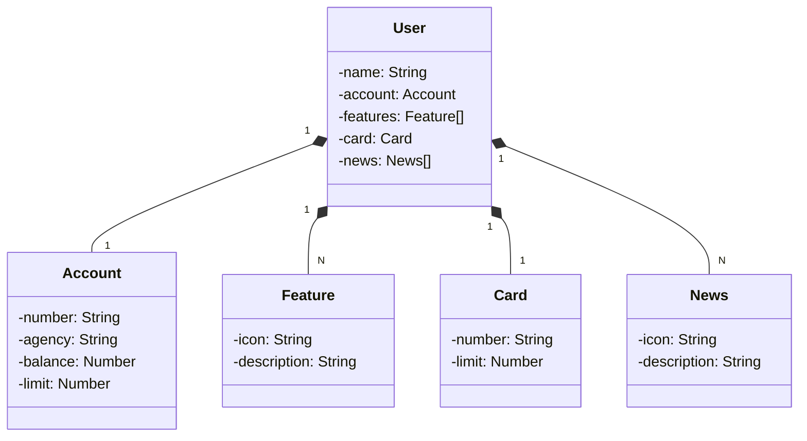

# DIO_Santander_Java_APi_RESTful_Java
Santander Bootcamp 2023 - Backend | Java RESTful API criada para a Santander Java Week.

# Nota Importante: Este Projeto é Estritamente Educacional

Caros visitantes,
Gostaríamos de enfatizar que este projeto tem exclusivamente fins educacionais. Sua concepção e implementação destinam-se à aprendizagem e desenvolvimento de habilidades técnicas.
Agradeço pela compreensão e respeito à natureza educacional deste projeto.

Atenciosamente, Douglas Moro.

## Diagrama de classes

